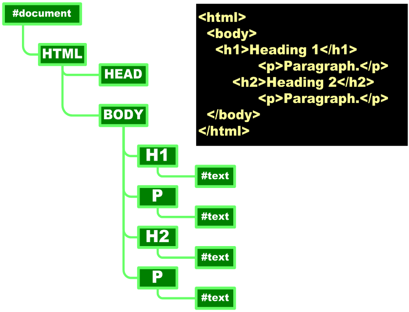

## API DOM {#api-dom}

Document Object Model – DOM é uma API do JavaScript padronizada pela World Wide Web Consortium – W3C que nos permite acessar e modificar a estrutura de um documento HTML e XML. Devido a esta API é possível dinamizar as aplicações web. Uma analogia pode ser feita com a API DOM como sendo uma árvore genealógica dos elementos de um documento HTML ou XML.

Figura 19 - Representação do modelo de objetos de um documento HTML

Para um estudo mais detalhado sobre a API DOM são recomendados os links abaixo:

*   [https://developer.mozilla.org/en-US/docs/Web/API/Document_Object_Model/Introduction](https://developer.mozilla.org/en-US/docs/Web/API/Document_Object_Model/Introduction)
*   [http://htmldog.com/guides/javascript/intermediate/thedom/](http://htmldog.com/guides/javascript/intermediate/thedom/)